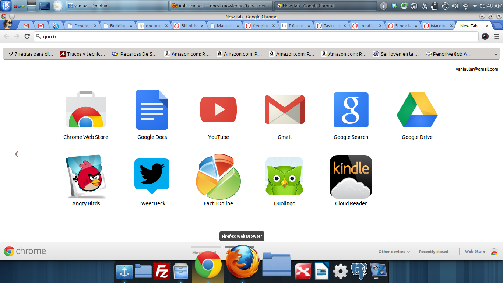

============
Aplicaciones
============

---------
Linux KDE
---------

- Docky:  un elemento de interfaz gráfica de usuario que permite a los usuarios iniciar, cambiar y
  monitorizar aplicaciones.
- Retext: sudo apt-get install retext, Escribe rst o md y renderiza con un click.

   Docky

- Boot repair: reparar boot desde linux
